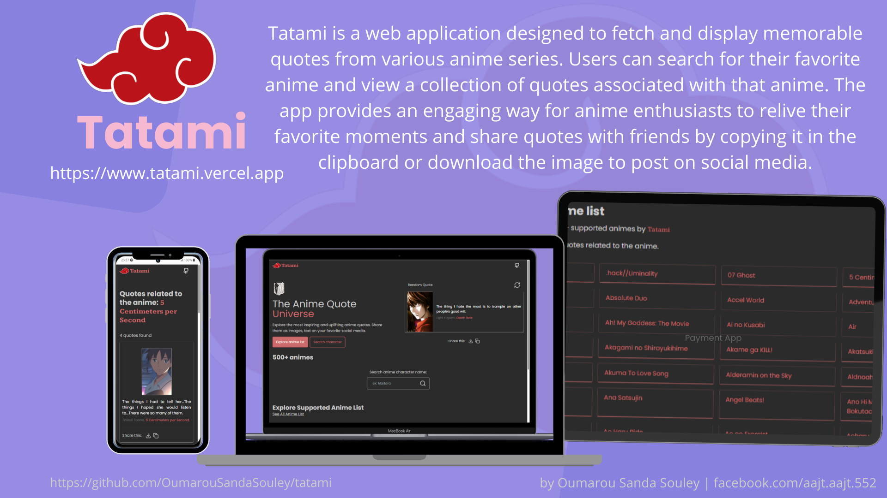

# Tatami

Tatami is a web application designed to fetch and display memorable quotes from various anime series. Users can search for their favorite anime and view a collection of quotes associated with that anime. The app provides an engaging way for anime enthusiasts to relive their favorite moments and share quotes with friends by copying them to the clipboard or downloading the image to post on social media.

## Features

- **Search Anime Quotes**: Users can search for quotes from their favorite anime series.
- **Search Anime Character**:  Users can search for quotes from their favorite anime character.
- **View Quotes**: Display a collection of quotes associated with the searched anime.
- **Copy to Clipboard**: Easily copy quotes to the clipboard for sharing.
- **Download Image**: Download quotes as images to share on social media.

## Demo

You can check out the live demo here: tatami.vercel.app

## Screenshots



## Installation

1. Clone the repository:
    ```bash
    git clone https://github.com/OumarouSandaSouley/tatami
    cd tatami
    ```

2. Install dependencies:
    ```bash
    npm install
    ```

3. Create a `.env` file in the root directory and add your RapidAPI key:
    ```env
    VITE_RAPID_API_KEY=your_rapidapi_key
    ```

4. Start the development server:
    ```bash
    npm run dev
    ```

## Usage

1. Open your browser and navigate to `http://localhost:3000`.
2. Use the search bar to find quotes from your favorite anime series.
3. Copy quotes to the clipboard or download them as images to share on social media.

## API

This application uses the AnimeQuotes API from RapidAPI to fetch anime quotes.
Find it here an generate your API Key: [AnimeQuotes API RapidAPI](https://rapidapi.com/wucarderapproved/api/anime-quotes5)

## Technologies Used

- **React**: A JavaScript library for building user interfaces.
- **React Router DOM**: For routing and navigation.
- **AnimeQuotes API**: To fetch anime quotes.
- **Tailwind CSS**: For styling the application.

## Contributing

Contributions are welcome! Please fork the repository and submit a pull request.

## License

This project is licensed under the MIT License. See the LICENSE file for details.

## Contact

If you have any questions or suggestions, feel free to reach out to me at [oumarousandasouley@gmail.com].

---

Enjoy using Tatami and relive your favorite anime moments!
